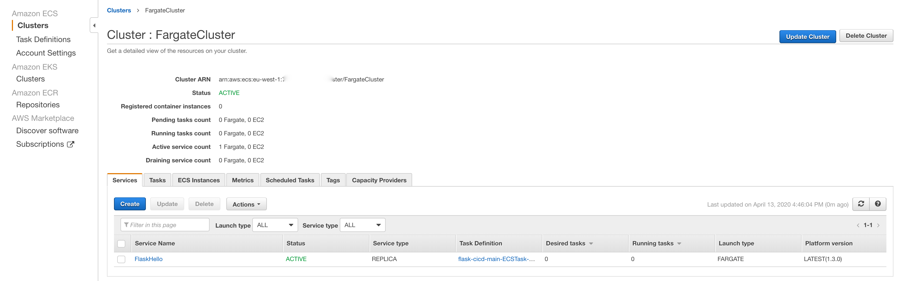

# DevOps on AWS
This project attempts to give theoretical and practical experience in DevOps in AWS-oriented projects.

## What is DevOps?
##### Definition (From [Wikipedia, 2020](https://en.wikipedia.org/wiki/DevOps))
> DevOps is a set of practices that combines software development (Dev) and information-technology operations (Ops) which aims to **shorten the systems development life cycle** and provide **continuous delivery with high software quality**

This definition shows that the value of DevOps lies in shortening the time-to-market of new software. However, this definition is only one of thousands that all aim to grasp the concept of DevOps.
In this project, we will interpret DevOps as:
* Managing the **full release cycle** of an application to cut dependencies and shorten the time to market
* Providing **continuous integration**, such that newly developed code can go to production as fast as possible
* Defining **everything as code**, such that manual errors are avoided

##### What does this mean in practice?

In this project, we will create an example where CodePipeline deploys a Docker container to ECS Fargate. 
This repo is intended to be used for learning purposes. By this repo, we try to teach about three things:
* **IaC**: Infrastructure as code with AWS CloudFormation
* **Docker**: This project runs a Dockerized Flask application
* **CI/CD**: In this project, an AWS CodePipeline is created which takes care of the entire release cycle.
From the source code, this pipeline will build a Docker image, push it to AWS ECR and deploy an ECS Service running on Fargate.
This container will be reachable from the public internet and can be used to verify the setup.

## How to use this repository

This project contains an actual setup of AWS infrastructure. 
It holds code to do a real cloud setup, as well as information about the concepts that are thought

### Project layout
```bazaar
+-- bin                      # Folder that holds executables
|    +-- run                    # Script to run the setup
|    +-- teardown               # Script to cleanup AWS resources
+-- code                     # The code of the actual application
|    +-- api.py                 # The code for the Flask API
|    +-- buildspec.yml          # The build specifications used by AWS CodeBuild
|    +-- Dockerfile             # Dockerfile used for the Flask Application
|    +-- requirements.txt       # Python dependency file
+-- infra                    # AWS CloudFormation scripts (IaC)
|    +-- bucket.yaml            # Template for the initial bucket used by AWS Cloudformation
|    +-- main.yaml              # Template for the full pipeline and application stack
+-- .gitignore
+-- README.md
```

### Setting up the services
This section discusses the cloud setup that is used as teaching material.

#### Prerequisites
To run this project you will need the following:
* `aws-cli` installed
* Access to an AWS account from the CLI
* Docker installed


This repository can be ran with Docker, more on Docker below!. 
This script will walk you through the different steps in the process as well as explaining these steps.
You can overwrite some parameters as environment variable using the `-e` flag.
```bazaar
docker build -t demo . && docker run -e BUCKET_NAME=my-bucket -e VPC_ID=my-vpc -e REGION=eu-west-1 demo       # Run the setup!
```
An executable for deleting the stack is also available.
```bazaar
./bin/teardown  # Delete the stack
```

#### Components
This setup contains a number of resources, which make up both the application stack, infrastructure and deployment resources.
You will get:
* An **S3 bucket**, which will be used as the artifact store in CodePipeline, and store for internal use of CloudFormation.
* An **AWS CodeCommit repository** which holds the Flask application code in it.
  This may seam strange, because this project lives in GitHub. But as we try to show CI/CD in the AWS ecosystem, we will copy the code into AWS CodeCommit.
* An **Elastic Container Registry** repository. An ECR repo is a location where you can store container images. Thiis registry will be created with one repository in it, which holds the images for the Flask application.
* An **ECS Fargate Service**. This service will run the application. Fargate is part of Amazon's Elastic Container Service where you do not manage the underlying EC2 instances that run the containers.
  The service runs on an **ECS cluster**. An ECS Service, holds a set of **ECS Task**. You can look at an ECS Task as a deployment of containers. A task is specified by an **ECS TaskDefinition**.
* An **AWS CodePipeline** that manages the building and deployment of the application.
* A **Public Subnet** where your containers will run. This is public to make the containers accessible.
* A **Security Group** that will allow TCP traffic to port 5000 and port 80.
* A **Network Load Balancer** that manages traffic to the application. If you want to un multiple instances of the service, this NLB will distribute the traffic evenly between containers.
  An TCP **Listener** will forward traffic to the load balancer to the NLB **TargetGroup**. All containers will be registered as targets in the TargetGroup.
* **IAM roles and policies** necessary to do the deployment

In a picture, this is on a high level the layout of the stack:


## Theory

This section will discuss the theory behind the core concepts that we want to discuss:
* Infrastructure as Code
* Docker
* Continuous Integration / Continuous Deployment


### Infrastructure as code

##### How to create AWS resources?
There are numerous ways to create a simple AWS resource like an S3 bucket:
* AWS CLI
* AWS S3 API
* Using an AWS SDK like boto3
* Using the AWS console

Another way is using AWS Cloudformation, AWS's service to create Infastructure as code in AWS.
##### Definition ([Wikipedia, 2020](https://en.wikipedia.org/wiki/Infrastructure_as_code))
>  Infrastructure as code is the process of managing and provisioning computer data centers through machine-readable definition files, rather than physical hardware configuration or interactive configuration tools

This definition can be broken down into some interesting parts:
* **Managing and provisioning**: Important to notice is that infrastructure as code is not only about setting up the infrastructure, but also managing it, after it was set up. 
CloudFormation keeps state of the resources that it created and can make updates if the specifications change. This is what is called a 'declarative' approach.
In a declarative approach, you don't specify the actions needed to create a resource, but you specify the desired state of it. 
CloudFormation will then determine which changes it has to make to the existing stack, to satisfy these constraints.
* **Machine-readable definition files**: CloudFormation uses JSON or YAML files to let the user specify the infrastructure. In this example, we use YAML.

##### CloudFormation templates

In this section, we will take a look at the most important parts of a CloudFormation template.
* **Parameters**: Using the parameters, you can declare variables to use in your template. 
These parameters can also be overwritten from the command line using the `--parameter-overrides key1=value1` flag. 
This can be particularly useful for deploying the same stack in multiple regions, QA vs Production... 
Parameters can be referenced by using `!Ref` inside your template.
* **Resources**: In this section, you specify the main body of your stack. This part holds the definitions of all resources that are part of your stack.
Resources are created with a among others name, type, properties, deletion policy and dependencies.
* **Outputs**: In the outputs section, you can query some values that are created by your application. An example could be the ARN of a resource, the endpoint of a load balancer...

Other useful features
* `!Ref` can be used for more than just parameters. CloudFormation resource attributes can be gotten from the `!Ref` operator as well.
Which attribute you will get, depends on the resource type and can be found in the API docs. Typically thihs will give you a name or ARN.
* `Fn`: CloudFormation offers you a set of functions that can be used in the templates. The most useful one is probably the `GetAtt` function, which will allow you to get attributes from a resource.
Available attributes are also listed in the API docs and are dependent on the resoure type.

To create a cloudformation stack, you can easily use the AWS CLI:
```bazaar
aws cloudformation deploy --stack-name my-stack --template-body file:///path/to/file.yaml
```
##### Examples

To conclude the theory about Infrastructure as Code, we give some examples that give more insight into how this works in practice.
* An S3 bucket (Copied from [AWS docs](https://docs.aws.amazon.com/AWSCloudFormation/latest/UserGuide/aws-properties-s3-bucket.html))
```yaml
Resources:
  S3Bucket:
    Type: AWS::S3::Bucket
    DeletionPolicy: Retain
    Properties:
      BucketName: my-bucket

```
* An IAM role (Copied from [AWS docs](https://docs.aws.amazon.com/AWSCloudFormation/latest/UserGuide/aws-resource-iam-role.html))
```yaml
AWSTemplateFormatVersion: 2010-09-09
Resources:
  RootRole:
    Type: 'AWS::IAM::Role'
    Properties:
      AssumeRolePolicyDocument:
        Version: 2012-10-17
        Statement:
          - Effect: Allow
            Principal:
              Service:
              - ec2.amazonaws.com
            Action:
              - 'sts:AssumeRole'
      Path: /
      Policies:
        - PolicyName: root
          PolicyDocument:
            Version: 2012-10-17
            Statement:
              - Effect: Allow
                Action: '*'
                Resource: '*'
  RootInstanceProfile:
    Type: 'AWS::IAM::InstanceProfile'
    Properties:
      Path: /
      Roles:
        - !Ref RootRole
```
* A complete template example in JSON for DynamoDB (Copied from [AWS examples](https://s3.us-west-2.amazonaws.com/cloudformation-templates-us-west-2/DynamoDB_Table.template))
```json
{
  "AWSTemplateFormatVersion" : "2010-09-09",
 
  "Description" : "AWS CloudFormation Sample Template DynamoDB_Table: This template demonstrates the creation of a DynamoDB table.  **WARNING** This template creates an Amazon DynamoDB table. You will be billed for the AWS resources used if you create a stack from this template.",
 
  "Parameters" : {
    "HashKeyElementName" : {
      "Description" : "HashType PrimaryKey Name",
      "Type" : "String",
      "AllowedPattern" : "[a-zA-Z0-9]*",
      "MinLength": "1",
      "MaxLength": "2048",
      "ConstraintDescription" : "must contain only alphanumberic characters"
    },

    "HashKeyElementType" : {
      "Description" : "HashType PrimaryKey Type",
      "Type" : "String",
      "Default" : "S",
      "AllowedPattern" : "[S|N]",
      "MinLength": "1",
      "MaxLength": "1",
      "ConstraintDescription" : "must be either S or N"
    },

    "ReadCapacityUnits" : {
      "Description" : "Provisioned read throughput",
      "Type" : "Number",
      "Default" : "5",
      "MinValue": "5",
      "MaxValue": "10000",
      "ConstraintDescription" : "must be between 5 and 10000"
    },

    "WriteCapacityUnits" : {
      "Description" : "Provisioned write throughput",
      "Type" : "Number",
      "Default" : "10",
      "MinValue": "5",
      "MaxValue": "10000",
      "ConstraintDescription" : "must be between 5 and 10000"
    }
  },
 
  "Resources" : {
    "myDynamoDBTable" : {
      "Type" : "AWS::DynamoDB::Table",
      "Properties" : {
        "AttributeDefinitions": [ { 
          "AttributeName" : {"Ref" : "HashKeyElementName"},
          "AttributeType" : {"Ref" : "HashKeyElementType"}
        } ],
        "KeySchema": [
          { "AttributeName": {"Ref" : "HashKeyElementName"}, "KeyType": "HASH" }
        ],
        "ProvisionedThroughput" : {
          "ReadCapacityUnits" : {"Ref" : "ReadCapacityUnits"},
          "WriteCapacityUnits" : {"Ref" : "WriteCapacityUnits"}
        }                
      }
    }
  },
 
  "Outputs" : {
    "TableName" : {
      "Value" : {"Ref" : "myDynamoDBTable"},
      "Description" : "Table name of the newly created DynamoDB table"
    }
  }
}
```

### Docker
This section explains the theory behind Docker and how it works in practice

##### Problem statement
Below, you will find some typical real-life scenario's Docker tries to solve:
* My code runs on my laptop, but not on yours.
* Before deploying my code, I will have to stop the application of the server, perform updates and then deploy my new application version.
* I am not sure which dependencies I need to add to run my application on the server.

##### So, what is it?
Docker is a tool that allows you to **package applications** in full, and run them on any machine. 
Much like a Virtual Machine, Docker not only packages your code, but also all dependencies and an entire filesystem and operating system.
However, Docker operates differently from a VM. In a VM, the guest operating system directly interacts with the Hypervisor of the host. 
This means that a VM typically has its own operating system, whereas Docker uses a generic, shared software component to interact with the host, called the Docker Engine.
An application in Docker is packaged in what we call an **image**. Running an image results in a **container**. 
This means that you can have multiple containers that run one image, but not have one container that runs multiple images.
Running multiple VM's, means multiple guest operating systems, but running multiple Docker containers result in only one Docker Engine.


Source: https://wiki.aquasec.com/display/containers/Docker+Containers+vs.+Virtual+Machines (2020)

##### Creating Docker images
To specify how your application should be packaged, you can add a `Dockerfile` to your project.
A full reference on the specifications of these files is available on [Docker docs](https://docs.docker.com/engine/reference/builder/).

We will take a look at an example line-by-line, the Docker file for the Flask application of the project.
```docker
FROM python:3

EXPOSE 5000/tcp

WORKDIR /app

COPY . /app

RUN pip install -r requirements.txt

ENTRYPOINT [ "python", "api.py"]

```
* `From python:3`: Docker images always start from a base image. On [DockerHub](https://hub.docker.com/) and the public internet, you can find hundreds of publicly available images to start from.
In this case, we just need an image that has Python installed.
* `EXPOSE 5000/tcp`: This line is added to open the port 5000 on the container (the port of the Flask app). This port will be mapped to `http://localhost` so that you can reach your application.
* `WORKDIR /app`: we will create a directory on the container filesystem called app.
* `COPY . /app`: Copy all code from the current directory to the `/app` folder
* `RUN pip install -r requirements.txt`: Install all dependencies listed in the requirements file.
* `ENTRYPOINT [ "python", "api.py"]`: Run the API when the container starts

Inside the  `./code` folder, you can build the image by running 
```bazaar
docker build -t app .
```
Here `app` is the name that you give to the image. Then you can run it by (the `-p` flag is used to map the container port to the host port)
```bazaar
docker run -p 5000:5000 app
```
Your app can be checked on `http://localhost:5000`

##### Docker registries
If you created an image, you can make it available in a container registry. These registries can be public, but also private.
For example, you can build an image on your laptop, push it to a registry, pull it on a remote server and run it.
AWS offers you a managed container registry in the form of ECR. Inside this registry, you can create repositories. A repository typically contains images of the same application. 
Each image is a different version of the application and can be distinguished by a tag. A tag can be for example the git commit hash, but also a logical name such as `v1` or `1.0.0`.

##### Useful commands
* List your images: `docker images`
* See your running containers: `docker ps`
* Get login command for ECR: `aws ecr get-login`
* Download an image: `docker pull registry/repository:tag`
* Push an image to a registry: `docker push registry/repository:tag`

### CI/CD
By Continuous Integration / Continuous deployment, we try to shorten the time that a new feature can be brought to production. 
This process often goes together with software versioning, automated testing release management... 
In this project we take the simple example of building the Docker image from the source code and deploying it to AWS ECS.

##### Pipelines
Typically CI/CD is achieved by automating a set of steps. This step function is called a pipeline. The pipeline often consists of custom scripts, related to your problem statement.
Common steps are:
* Checkout source code
* Build (Docker image, JAR file, ZIP, Python package, binary...)
* Automated tests
* Infrastructure updates (easy with IaC!)
* Install dependencies
* Deploy code (Copy to server, run container, start new EC2 instances...)
* Publish release notes

##### Common AWS tools
* AWS CodeCommit: Git repositories in AWS
* AWS CodeBuild: Build code packages and images
* AWS CodeDeploy: Used to deploy applications to EC2, ECS, Lambda...
* AWS CodePipeline: Orchestration service to manage the above services


## Demo
This section shows what this project hahs to offer you, in case you are not interested in setting it up yourself. It will walk you through a demo using screenshots.

### Setting up the stack
When you build and run the Dockerfile in this project, a container will create a CloudFormation stack for you. 
In the AWS console, you can monitor the resource creation of this stack. In total, you will get two stacks, one for an initial bucket, which is needed for artifacts in the second stack.
It will look something like this:


The console will show you all created resources with their current status. If everything goes well, all resources will be in the CREATE_COMPLETE state. 
If not, you can use the Events tab to debug. Setting up the resources might take a couple of minutes. Apart from the resources, you will also get an 'Outputs' tab.
This section will show parameters that are a result of the stack creation. The ELB DNS name is the one that is interesting for us.

In the list of resources, the most interesting ones we will look at are the CodeCommit repo, CodePipeline pipeline and the FargateService.
If you navigate to AWS CodeCommit in the AWS Console, you will find a repository there with the application code in there.


When CloudFormation creates a CodePipeline, it will start an initial run based on the initial commit in the CodeCommit repository. In the Console, you can see this if you go to AWS CodePipeline.

In the notes of the different stages, you can see that the execution is built based on the Initial commit by AWS CodeCommit. 
The initial execution has gone through the 'Build' stage, which has built a Docker image and stored it to Amazon ECR. We will look at it later. 
Also, it has deployed this release to AWS Fargate. Now everything is ready for us to run the application!

### Start the FargateService
In AWS Fargate, you can choose how many replica's of your container you want to run in the service. 
Fargate will try to make sure that this number is respected, even if containers fail etc. Go to AWS ECS in the console and you will find a section called Clusters.
There you will see a FargateCluster defined. In the services tab, a service will be defined that will run our application.


The service now has a desired count of 0 running tasks. If we click edit on the service, we can set this to any number we want. This is a one time activity to get the service started<sup>*</sup>.


<sup>*</sup>The desired count of tasks can also be set from CloudFormation. However, because the docker image that is used for the service does not exist at the moment of creating the service,
the service can never start to run a container. Due to this, the FargateService will never reach its CREATE_COMPLETE state. This is why we have set it to 0.

### Check out the application
When the tasks in the Fargate service reach the RUNNING state, the application is online! Go to the hostname of the ELB (which you can find in the outputs of the CloudFormation stack) and see the application.
(NB: The first time, the ELB might time out. Refresh a couple of times and it will come alive)


### CI/CD in action
Now let's move to the beautiful part of this setup. Let us make a change to the application and see the CI/CD pipeline practice its magic.
Go to CodeCommit and change the application. You can do this in your browser, or clone the repository and push with Git. In this example, we will add a simple feature, that asks the user how he is doing.


Next step is to trigger the CodePipeline to release a new change. You could also configure the pipeline to listen to commits automatically. For the sake of this demo, we will let you trigger it yourself.
In AWS CodePipeline, click 'Release Change'. CodePipeline will start a new execution. On the stages, it will show you the commit that it is using to build the new artifacts.


The Build stage of the pipeline will push a new image to Amazon ECR. This will be the new image that we have to run our application from. 
If you go to AWS ECR in the console, you will see two images, the initial one with the old version of the code, and the new one.


The Deploy stage will start a new task on AWS ECS Fargate, that will gradually take over from the old version. 
For a while, you will have two versions of your app running, after which the new one will take over, and the old one will be stopped.
In the console, you can see this in AWS ECS, on your Fargate service in the `Tasks` tab.
Fargate will automatically decommission the old tasks once your new one is online. If you see that this happened, refresh the tab with the ELB and see the new version of your app!


That's it! You now have a complete CI/CD pipeline using nothing but AWS tools that allows you to bring new versions of your application to production. 
You can now enrich your pipeline with automated testing, automation of release notes, matching branches to environments or whatever it is that you require.
To teardown the stack, you can use the CloudFormation console. Some resources will however not be deleted, due to safety constraints in AWS Cloudformation.
It is best to delete your ECR images, S3 objects and Fargate tasks manually.


## Notes
Questions or ideas? Not only you can learn, but so can I! Feel free to reach out or contribute if you have a question, cool idea or a new feature!
